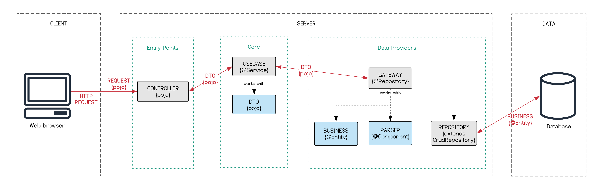

# :package: Redex 

Redex is a business platform for managing the package delivery process

## :package: Motivation 

Inspired by uncle bob, this is our first attempt to apply Clean Architecture with Java


### :package: Architecture

In progress

### :package: Prerequisites

* Spring Boot v2.3.2 
* IntelliJ v2020.+
* Maven v3.+
* AWS Account

### :package: Project Structure


### :package: Project File Structure

```
└───application
    ├───core
    │   ├───model
    │   │   ├───business
    │   │   └───dto
    │   │       └───report
    │   └───usecase
    │       ├───branch
    │       ├───client
    │       ├───documentType
    │       ├───etflight
    │       ├───packageCategory
    │       ├───packagingType
    │       ├───report
    │       ├───role
    │       ├───shipment
    │       ├───shipmentState
    │       ├───simulation
    │       ├───user
    │       └───util
    │           ├───algorithm
    │           │   ├───structure
    │           │   └───util
    │           ├───classificator
    │           ├───counter
    │           │   ├───incident
    │           │   └───shipment
    │           ├───detector
    │           │   └───incident
    │           └───generator
    │               └───referenceCode
    ├───data
    │   ├───gateway
    │   ├───parser
    │   ├───repository
    │   └───util
    │       ├───hashing
    │       └───reading
    ├───rest
    │   └───api
    │       ├───controller
    │       └───request
    │           └───registerShipment
    └───shared
        ├───charge
        ├───configuration
        ├───exception
        │   ├───custom
        │   └───resource
        └───listener
            └───util
```
## :smile_cat: Authors

* [**Patricia Esparza**](https://gitlab.com/PatriciaEsparza1998) 
* [**Percy Quezada**](https://gitlab.com/percy.quezada)
* [**Willy Chung**](https://gitlab.com/WillyTz)
* [**Arturo Lucas**](https://gitlab.com/Heisenberg098)

## :alien: License

This project is licensed under the MIT License - see the [LICENSE.md](LICENSE.md) file for details

